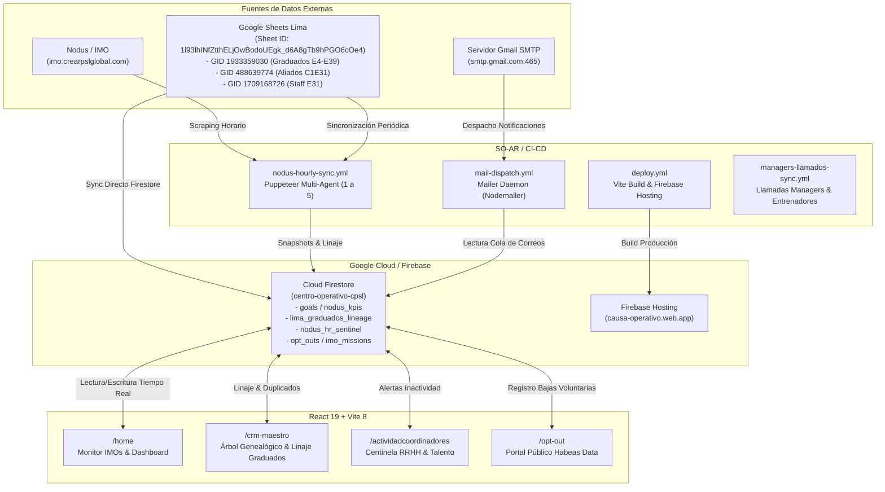

# 📦 CAJA NEGRA OPERATIVA & TÉCNICA (SISTEMA CAUSA OS - CPSL)

**Plataforma Central:** Causa OS — Centro de Liderazgo, CRM & Orquestación Autónoma  
**URL de Producción:** [https://causa-operativo.web.app](https://causa-operativo.web.app) / [https://centro-operativo-cpsl.web.app/home](https://centro-operativo-cpsl.web.app/home)  
**Repositorio Principal:** [`crearpodersinlimitesperu-cmd/SO-AR`](https://github.com/crearpodersinlimitesperu-cmd/SO-AR) (rama `master`)  
**Fecha de Certificación y Consolidación:** 12 de Septiembre de 2026  
**Auditor & Arquitecto:** Antigravity AI (Google DeepMind)  
**Directiva Permanente del Sistema:** **"AGREGAR TODO A LA CAJA NEGRA SIEMPRE"** — Cada cambio, regla de negocio, credencial, arquitectura o integración técnica debe quedar inmediatamente registrado y versionado en este documento.

---

## 1. 🏛️ Arquitectura General del Ecosistema

El sistema **Causa OS (SO-AR)** opera como el centro neurálgico de control, reportería, seguimiento de metas, CRM genealógico y sincronización autónoma para la organización **Crear Poder Sin Límites (CPSL)** en todas sus sedes (Lima, Quito, Guayaquil, Cuenca, Medellín y México).



---

## 2. 🔐 Inventario Certificado de Credenciales y Secretos Operativos

> [!IMPORTANT]
> Todos los valores de esta sección han sido probados técnicamente mediante handshakes TLS, endpoints OAuth2 de Google, navegación simulada Puppeteer Stealth y transacciones de Firestore.

### 2.1. Nodus / Plataforma IMO
* **Portal Oficial:** `https://imo.crearpslglobal.com/`
* **Usuario Maestro:** `CREARPSL`
* **Contraseña Verificada:** `CREARPSL26*`
* **Regla de Oro Crítica:**
  * La contraseña **DEBE incluir el asterisco final (`*`)**.
  * Si se ingresa `CREARPSL26` (sin asterisco), el backend responde HTTP 200 pero mantiene al usuario en `/auth/login` sin mensaje de error (rechazo silencioso).
  * Con `CREARPSL26*`, el backend responde HTTP 302 y autoriza la sesión redirigiendo inmediatamente a `/sedes`.

### 2.2. Servidor de Correo (Gmail SMTP)
* **Host / Puerto:** `smtp.gmail.com:465` (SSL/TLS nativo)
* **Cuenta Remitente:** `servidorcrearpsl@gmail.com`
* **Contraseña de Aplicación:** `oaqx **** **** bwuo` (Registrada como `GMAIL_PASS` en GitHub Secrets).
* **Estado SMTP:** Autenticación aprobada con código `235 2.7.0 Accepted`.
* **Función Operativa:** Envío automatizado de bienvenidas IMO, alertas de inactividad, recordatorios de metas, invitaciones y notificaciones de coordinación.

### 2.3. Firebase: CI Tokens vs. Service Account (Solución Permanente)
* **Tokens de CI (`1//...`):**
  * Presentan error de validación `invalid_grant (invalid_rapt)`. Este comportamiento se debe a las directivas de control de sesión de Google Workspace que invalidan los Refresh Tokens generados por `firebase login:ci`.
* **Solución de Producción Implementada:**
  * El workflow `.github/workflows/deploy.yml` **no utiliza ni requiere `FIREBASE_TOKEN`**.
  * Autenticación blindada mediante **Cuenta de Servicio de Google Cloud** (`GOOGLE_SERVICE_ACCOUNT_JSON` / `GOOGLE_APPLICATION_CREDENTIALS`).
  * Esta cuenta de servicio nunca vence por sesión y garantiza despliegues automáticos ininterrumpidos ante cada push a `master`.

### 2.4. Tokens de GitHub (PATs)
* **Cuenta Propietaria:** `crearpodersinlimitesperu-cmd`
* **Repositorio:** `crearpodersinlimitesperu-cmd/SO-AR`
* **Token en GitHub Secrets:** `GH_PAT` (Permisos plenos: `repo`, `workflow`, `admin:org`).

### 2.5. Token Robot para Firestore
* **Identificador:** `robot_token = "NODUS_ROBOT_CPSL_2026_SECRET"`
* **Permisos:** Permite a scripts y agentes autónomos desatendidos escribir en Firestore (`nodus_kpis_sincronizados`, `nodus_coordinadores_c1c2`, `nodus_hr_sentinel`, `lima_graduados_lineage`, etc.) cumpliendo con `firestore.rules`.

---

## 3. 🤖 Directorio de Agentes Autónomos en Causa OS

| # | Agente | Script / Módulo | Función Principal |
| :-: | :--- | :--- | :--- |
| **1** | **Extractor de Nodus** | `scripts/nodusMultiAgentSync.mjs` | Inicia sesión con Puppeteer Stealth, sortea WAFs y extrae KPIs de sedes, 23 tarjetas de coordinadores y 18 equipos activos. |
| **2** | **Normalizador de Sedes** | `scripts/nodusMultiAgentSync.mjs` | Homologa etiquetas entre sedes y unifica escuadras duales (ej: `EQUIPO 29` y `EQUIPO 29 - LIMA CICLO 1 V`). |
| **3** | **Despachador de Snapshots** | `scripts/nodusMultiAgentSync.mjs` | Publica en tiempo real los snapshots en Firestore (`nodus_kpis_sincronizados`, `nodus_coordinadores_c1c2` e `imo_missions`). |
| **4** | **Científico de Datos & Predictor** | `src/pages/PortfolioBoard.jsx` | Proyecciones matemáticas de metas, tasas de conversión y cumplimiento sin alucinaciones. |
| **5** | **Centinela de RRHH (Coordinadores)** | `scripts/nodusHrSentinelAgent.mjs` | Monitorea ratio de llamadas vs. asignados. Alerta inactividad crítica (0 llamadas) o rezago (<35%) y emite pautas de coaching 1:1. |
| **6** | **Agencia de Marketing & Nurturing** | `scripts/nodusMarketingAgencyAgent.mjs` | Sostenimiento de prospectos, correos de seguimiento, tokens HMAC-SHA256 y portal de baja voluntaria `/opt-out`. |
| **7** | **Guardián de la Genealogía & Linaje** | `src/services/crmGenealogyAgent.js` | Matching difuso con 399 egresados de Lima, auditoría de duplicados nominales/DNI y enriquecimiento del árbol con historial de servicio. |
| **8** | **Monitor de Llamadas Entrenadores** | `scripts/sync_managers_llamados.mjs` | Extracción sin redundancia basada en hashing determinista `hash(coach + manager + fecha + etapa)` para llamadas a managers. |

---

## 4. 📊 Bases de Datos Externas & Google Sheets Oficiales

### 4.1. Google Spreadsheet Oficial de Lima
* **ID:** `1l93lhINfZtthELjOwBodoUEgk_d6A8gTb9hPGO6cOe4`
* **Pestaña `GRADUADOS ` (GID: `1933359030`):**
  * 399 Creadores Cuánticos históricos de Lima.
  * Columnas: `CREAR CUANTICO`, `EQUIPO ORIGINAL ` (E4 a E31), y participación por ciclo de `E5` a `E39`:
    * `M`: Manager de Entrenamiento (82 participaciones)
    * `C`: Coordinador / Capitán (19 participaciones)
    * `Q`: Staff Quantum Team (64 participaciones)
    * `A`: Aliado (288 participaciones)
* **Pestaña `ALIADOS C1E31` (GID: `488639774`):**
  * Directorio y metas de aliados para C1E31 de Lima asignados a:
    * Joyce Marin Suarez (`joyce.marin@crearpsl.net`)
    * Diana Moscoso Robles (`diana.moscoso@crearpsl.net`)
    * Linid Valencia (`linid.valencia@crearpsl.net`)
    * Leyla Pasquel (`leyla.pasquel@crearpsl.net`)
    * José Sánchez (`jose.sanchez@crearpsl.net`)
* **Pestañas de Staff:**
  * `STAFF ELITE CAP 1 E31` (GID: `1709168726`)
  * `STAFF E30` (GID: `695198016`)

---

## 5. 👥 Directorio Oficial de Liderazgo por Sede

| Sede | Bandera | Gerente / Responsable Principal | Correo Electrónico |
| :--- | :---: | :--- | :--- |
| **Lima** | 🇵🇪 | José Sánchez | `jose.sanchez@crearpsl.net` |
| **Quito** | 🇪🇨 | Emily Campuzano / David Sosa | `emily.campuzano@crearpsl.net` / `freddy.sosa@crearpsl.net` |
| **Guayaquil** | 🇪🇨 | Josué Vera | `josue.vera@crearpsl.net` |
| **Cuenca** | 🇪🇨 | July León | `emely.leon@crearpsl.net` |
| **Medellín** | 🇨🇴 | Yurany G Franco | `yurany.gonzalez@crearpsl.net` |
| **México** | 🇲🇽 | Nora Zamora | `nora.zamora@crearpsl.net` |
| **Dirección Global** | 🌐 | Fer Aragón / Paul Sosa / Andrés Gómez | `fer.aragon@crearpsl.net`, `paul.sosa@crearpsl.net`, `andres.gomez@crearpsl.net` |

---

## 6. 🌐 Catálogo de Módulos y Rutas de la Aplicación Web

* **`/home` (Monitor Principal & Dashboard Operativo):**
  * Visualización de las 332 misiones de liderazgo IMO, progreso de metas de enrolamiento y filtros por sede.
* **`/crm-maestro` (Árbol Genealógico de Enrolamiento & Linaje):**
  * Visualización jerárquica de líderes (IMOs) y sus participantes enrolados.
  * Badges de **Linaje de Graduados de Lima**: `🎓 Orig: E[X] (Lima)`.
  * Badges de servicio histórico: `👔 Manager`, `🧭 Coord`, `⚡ Quantum`, `🤝 Aliado`.
  * Historial desplegable de trayectoria de servicio por edición.
  * Filtro por equipo original (`E4` a `E27`) o por tipo de servicio.
  * Detección y auditoría de duplicados nominales y de DNI.
* **`/actividadcoordinadores` (Centinela de Talento Humano RRHH):**
  * Semáforo de actividad de coordinadores, alertas de inactividad crítica y rezago, y pautas de coaching para gerentes.
* **`/opt-out` (Portal Público de Desuscripción y Habeas Data):**
  * Validación criptográfica con HMAC-SHA256 y guardado en Firestore de bajas voluntarias.

---

## 7. 🛠️ Runbook de Contingencias y Operación

### 7.1. Disparo Manual de Workflows de GitHub Actions
```bash
# Sincronización Horaria Nodus
curl -X POST \
  -H "Authorization: Bearer <GH_PAT>" \
  -H "Accept: application/vnd.github+json" \
  https://api.github.com/repos/crearpodersinlimitesperu-cmd/SO-AR/actions/workflows/nodus-hourly-sync.yml/dispatches \
  -d '{"ref":"master"}'

# Despacho de Correos en Cola
curl -X POST \
  -H "Authorization: Bearer <GH_PAT>" \
  -H "Accept: application/vnd.github+json" \
  https://api.github.com/repos/crearpodersinlimitesperu-cmd/SO-AR/actions/workflows/mail-dispatch.yml/dispatches \
  -d '{"ref":"master"}'
```

### 7.2. Contingencia WAF / Anti-Bot SiteGround (`sgcaptcha`)
* **Síntoma:** El log de Puppeteer muestra redirección a `/.well-known/sgcaptcha/?r=...` y extrae 0 registros.
* **Causa:** Bloqueo temporal de rangos de IP de centros de datos de Azure / GitHub Actions.
* **Solución:** Reejecutar el workflow inmediatamente (el siguiente runner casi siempre toma una IP limpia) o activar la rotación de proxies desde `proxies.txt`.

### 7.3. Unificación Definitiva de Nombres de Equipos
* Las etiquetas cortas (`EQUIPO 29`) y largas (`EQUIPO 29 - LIMA CICLO 1 V`) en Nodus representan **la misma escuadra unificada**. No poseen participantes ni líderes duplicados; deben consolidarse en una sola entidad.

---

> 📜 **Mandato de la Caja Negra:**
> Esta Caja Negra es la fuente viva de verdad de CPSL y Causa OS. Debe consultarse antes de cualquier cambio de arquitectura y actualizarse de inmediato tras cada nueva funcionalidad, regla o descubrimiento operativo.
