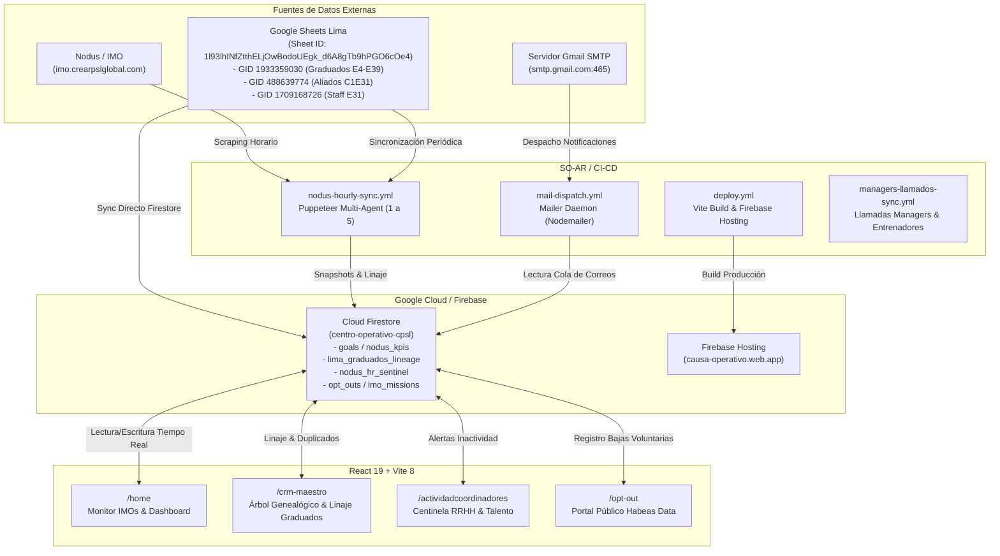

# 📦 CAJA NEGRA OPERATIVA & TÉCNICA (SISTEMA CAUSA OS - CPSL)

**Plataforma Central:** Causa OS — Centro de Liderazgo, CRM & Orquestación Autónoma  
**URL de Producción:** [https://causa-operativo.web.app](https://causa-operativo.web.app) / [https://centro-operativo-cpsl.web.app/home](https://centro-operativo-cpsl.web.app/home)  
**Repositorio Principal:** [`crearpodersinlimitesperu-cmd/SO-AR`](https://github.com/crearpodersinlimitesperu-cmd/SO-AR) (rama `master`)  
**Fecha de Certificación y Consolidación:** 12 de Septiembre de 2026  
**Última Actualización Registrada:** 13 de Septiembre de 2026 (ver Sección 11)  
**Auditor & Arquitecto:** Antigravity AI (Google DeepMind) / Claude Sonnet 5 (Anthropic) — actualizaciones del 13/09  
**Directiva Permanente del Sistema:** **"AGREGAR TODO A LA CAJA NEGRA SIEMPRE"** — Cada cambio, regla de negocio, credencial, arquitectura o integración técnica debe quedar inmediatamente registrado y versionado en este documento.

---

## 1. 🏛️ Arquitectura General del Ecosistema

El sistema **Causa OS (SO-AR)** opera como el centro neurálgico de control, reportería, seguimiento de metas, CRM genealógico y sincronización autónoma para la organización **Crear Poder Sin Límites (CPSL)** en todas sus sedes (Lima, Quito, Guayaquil, Cuenca, Medellín y México).



---

## 2. 🔐 Inventario Certificado de Credenciales y Secretos Operativos

> [!IMPORTANT]
> Todos los valores de esta sección han sido probados técnicamente mediante handshakes TLS, endpoints OAuth2 de Google, navegación simulada Puppeteer Stealth y transacciones de Firestore.

### 2.1. Nodus / Plataforma IMO
* **Portal Oficial:** `https://imo.crearpslglobal.com/`
* **Usuario / Contraseña:** Ver GitHub Secrets: `NODUS_USER` / `NODUS_PASSWORD`. No se documentan en texto plano en este archivo — el repositorio `SO-AR` es público (ver Sección 11.4).
* **Regla de Oro Crítica (conocimiento operativo, no es un secreto en sí):**
  * La contraseña **DEBE incluir el asterisco final (`*`)**.
  * Si se ingresa la contraseña sin el asterisco, el backend responde HTTP 200 pero mantiene al usuario en `/auth/login` sin mensaje de error (rechazo silencioso).
  * Con el asterisco correcto, el backend responde HTTP 302 y autoriza la sesión redirigiendo inmediatamente a `/sedes`.

### 2.2. Servidor de Correo (Gmail SMTP)
* **Host / Puerto:** `smtp.gmail.com:465` (SSL/TLS nativo)
* **Cuenta Remitente:** `servidorcrearpsl@gmail.com`
* **Contraseña de Aplicación:** Ver GitHub Secrets: `GMAIL_PASS`. No se documenta el valor (ni siquiera parcial) en este archivo — el repositorio `SO-AR` es público (ver Sección 11.4).
* **Estado SMTP:** Autenticación aprobada con código `235 2.7.0 Accepted`.
* **Función Operativa:** Envío automatizado de bienvenidas IMO, alertas de inactividad, recordatorios de metas, invitaciones y notificaciones de coordinación.

### 2.3. Firebase: CI Tokens vs. Service Account (Solución Permanente)
* **Tokens de CI (`1//...`):**
  * Presentan error de validación `invalid_grant (invalid_rapt)`. Este comportamiento se debe a las directivas de control de sesión de Google Workspace que invalidan los Refresh Tokens generados por `firebase login:ci`.
* **Solución de Producción Implementada:**
  * El workflow `.github/workflows/deploy.yml` **no utiliza ni requiere `FIREBASE_TOKEN`**.
  * Autenticación blindada mediante **Cuenta de Servicio de Google Cloud** (`GOOGLE_SERVICE_ACCOUNT_JSON` / `GOOGLE_APPLICATION_CREDENTIALS`).
  * Esta cuenta de servicio nunca vence por sesión y garantiza despliegues automáticos ininterrumpidos ante cada push a `master`.

### 2.4. Tokens de GitHub (PATs)
* **Cuenta Propietaria:** `crearpodersinlimitesperu-cmd`
* **Repositorio:** `crearpodersinlimitesperu-cmd/SO-AR`
* **Token en GitHub Secrets:** `GH_PAT` (Permisos plenos: `repo`, `workflow`, `admin:org`).

### 2.5. Token Robot para Firestore
* **Identificador:** `robot_token` — Ver GitHub Secrets: `ROBOT_TOKEN`. **Rotado el 13/09/2026** tras detectarse que el valor anterior estaba expuesto en texto plano en este documento y en el código fuente (repositorio público) — ver Sección 11.4 para el detalle completo y el riesgo estructural que permanece abierto.
* **Permisos:** Permite a scripts y agentes autónomos desatendidos escribir en Firestore (`nodus_kpis_sincronizados`, `nodus_coordinadores_c1c2`, `nodus_hr_sentinel`, `lima_graduados_lineage`, etc.) cumpliendo con `firestore.rules`.
* **Arquitectura:** Inyectado vía `process.env.ROBOT_TOKEN` en 11 scripts y 3 workflows de GitHub Actions (antes estaba hardcodeado como literal). Firestore Security Rules **no puede leer variables de entorno** — son archivos estáticos desplegados tal cual — por lo que el valor literal del token sigue existiendo en `firestore.rules`, dentro del repositorio público.

---

## 3. 🤖 Directorio de Agentes Autónomos en Causa OS

| # | Agente | Script / Módulo | Función Principal |
| :-: | :--- | :--- | :--- |
| **1** | **Extractor de Nodus** | `scripts/nodusMultiAgentSync.mjs` | Inicia sesión con Puppeteer Stealth, sortea WAFs y extrae KPIs de sedes, 23 tarjetas de coordinadores y 18 equipos activos. |
| **2** | **Normalizador de Sedes** | `scripts/nodusMultiAgentSync.mjs` | Homologa etiquetas entre sedes y unifica escuadras duales (ej: `EQUIPO 29` y `EQUIPO 29 - LIMA CICLO 1 V`). |
| **3** | **Despachador de Snapshots** | `scripts/nodusMultiAgentSync.mjs` | Publica en tiempo real los snapshots en Firestore (`nodus_kpis_sincronizados`, `nodus_coordinadores_c1c2` e `imo_missions`). |
| **4** | **Científico de Datos & Predictor** | `src/pages/PortfolioBoard.jsx` | Proyecciones matemáticas de metas, tasas de conversión y cumplimiento sin alucinaciones. |
| **5** | **Centinela de RRHH (Coordinadores)** | `scripts/nodusHrSentinelAgent.mjs` | Monitorea ratio de llamadas vs. asignados. Alerta inactividad crítica (0 llamadas) o rezago (<35%) y emite pautas de coaching 1:1. |
| **6** | **Agencia de Marketing & Nurturing** | `scripts/nodusMarketingAgencyAgent.mjs` | Sostenimiento de prospectos, correos de seguimiento, tokens HMAC-SHA256 y portal de baja voluntaria `/opt-out`. |
| **7** | **Guardián de la Genealogía & Linaje** | `src/services/crmGenealogyAgent.js` | Matching difuso con 399 egresados de Lima, auditoría de duplicados nominales/DNI y enriquecimiento del árbol con historial de servicio. |
| **8** | **Monitor de Llamadas Entrenadores** | `scripts/sync_managers_llamados.mjs` | Extracción sin redundancia basada en hashing determinista `hash(coach + manager + fecha + etapa)` para llamadas a managers. |

---

## 4. 📊 Bases de Datos Externas & Google Sheets Oficiales

### 4.1. Google Spreadsheet Oficial de Lima
* **ID:** `1l93lhINfZtthELjOwBodoUEgk_d6A8gTb9hPGO6cOe4`
* **Pestaña `GRADUADOS ` (GID: `1933359030`):**
  * 399 Creadores Cuánticos históricos de Lima.
  * Columnas: `CREAR CUANTICO`, `EQUIPO ORIGINAL ` (E4 a E31), y participación por ciclo de `E5` a `E39`:
    * `M`: Manager de Entrenamiento (82 participaciones)
    * `C`: Coordinador / Capitán (19 participaciones)
    * `Q`: Staff Quantum Team (64 participaciones)
    * `A`: Aliado (288 participaciones)
* **Pestaña `ALIADOS C1E31` (GID: `488639774`):**
  * Directorio y metas de aliados para C1E31 de Lima asignados a:
    * Joyce Marin Suarez (`joyce.marin@crearpsl.net`)
    * Diana Moscoso Robles (`diana.moscoso@crearpsl.net`)
    * Linid Valencia (`linid.valencia@crearpsl.net`)
    * Leyla Pasquel (`leyla.pasquel@crearpsl.net`)
    * José Sánchez (`jose.sanchez@crearpsl.net`)
* **Pestañas de Staff:**
  * `STAFF ELITE CAP 1 E31` (GID: `1709168726`)
  * `STAFF E30` (GID: `695198016`)

---

## 5. 👥 Directorio Oficial de Liderazgo por Sede

| Sede | Bandera | Gerente / Responsable Principal | Correo Electrónico |
| :--- | :---: | :--- | :--- |
| **Lima** | 🇵🇪 | José Sánchez | `jose.sanchez@crearpsl.net` |
| **Quito** | 🇪🇨 | Emily Campuzano / David Sosa | `emily.campuzano@crearpsl.net` / `freddy.sosa@crearpsl.net` |
| **Guayaquil** | 🇪🇨 | Josué Vera | `josue.vera@crearpsl.net` |
| **Cuenca** | 🇪🇨 | July León | `emely.leon@crearpsl.net` |
| **Medellín** | 🇨🇴 | Yurany G Franco | `yurany.gonzalez@crearpsl.net` |
| **México** | 🇲🇽 | Nora Zamora | `nora.zamora@crearpsl.net` |
| **Dirección Global** | 🌐 | Fer Aragón / Paul Sosa / Andrés Gómez | `fer.aragon@crearpsl.net`, `paul.sosa@crearpsl.net`, `andres.gomez@crearpsl.net` |

---

## 6. 🌐 Catálogo de Módulos y Rutas de la Aplicación Web

* **`/home` (Monitor Principal & Dashboard Operativo):**
  * Visualización de las 332 misiones de liderazgo IMO, progreso de metas de enrolamiento y filtros por sede.
* **`/crm-maestro` (Árbol Genealógico de Enrolamiento & Linaje):**
  * Visualización jerárquica de líderes (IMOs) y sus participantes enrolados.
  * Badges de **Linaje de Graduados de Lima**: `🎓 Orig: E[X] (Lima)`.
  * Badges de servicio histórico: `👔 Manager`, `🧭 Coord`, `⚡ Quantum`, `🤝 Aliado`.
  * Historial desplegable de trayectoria de servicio por edición.
  * Filtro por equipo original (`E4` a `E27`) o por tipo de servicio.
  * Detección y auditoría de duplicados nominales y de DNI.
* **`/actividadcoordinadores` (Centinela de Talento Humano RRHH):**
  * Semáforo de actividad de coordinadores, alertas de inactividad crítica y rezago, y pautas de coaching para gerentes.
* **`/opt-out` (Portal Público de Desuscripción y Habeas Data):**
  * Validación criptográfica con HMAC-SHA256 y guardado en Firestore de bajas voluntarias.

---

## 7. 🛠️ Runbook de Contingencias y Operación

### 7.1. Disparo Manual de Workflows de GitHub Actions
```bash
# Sincronización Horaria Nodus
curl -X POST \
  -H "Authorization: Bearer <GH_PAT>" \
  -H "Accept: application/vnd.github+json" \
  https://api.github.com/repos/crearpodersinlimitesperu-cmd/SO-AR/actions/workflows/nodus-hourly-sync.yml/dispatches \
  -d '{"ref":"master"}'

# Despacho de Correos en Cola
curl -X POST \
  -H "Authorization: Bearer <GH_PAT>" \
  -H "Accept: application/vnd.github+json" \
  https://api.github.com/repos/crearpodersinlimitesperu-cmd/SO-AR/actions/workflows/mail-dispatch.yml/dispatches \
  -d '{"ref":"master"}'
```

### 7.2. Contingencia WAF / Anti-Bot SiteGround (`sgcaptcha`)
* **Síntoma:** El log de Puppeteer muestra redirección a `/.well-known/sgcaptcha/?r=...` y extrae 0 registros.
* **Causa:** Bloqueo temporal de rangos de IP de centros de datos de Azure / GitHub Actions.
* **Solución:** Reejecutar el workflow inmediatamente (el siguiente runner casi siempre toma una IP limpia) o activar la rotación de proxies desde `proxies.txt`.

### 7.3. Unificación Definitiva de Nombres de Equipos
* Las etiquetas cortas (`EQUIPO 29`) y largas (`EQUIPO 29 - LIMA CICLO 1 V`) en Nodus representan **la misma escuadra unificada**. No poseen participantes ni líderes duplicados; deben consolidarse en una sola entidad.

---


## 8. Avance de Llamadas de Equipos en Tablero de Metas (/metas)

### 8.1. Proposito y Arquitectura
Permite a directores, coordinadores y managers auditar en tiempo real el avance de gestiones telefonicas de las coordinadoras y managers para cada meta operativa (ej. "Sentados (Px) - Capitulo 1", Equipo 30 Lima) sin abandonar la vista de metas de Causa OS.

### 8.2. Componentes Implementados (src/pages/GoalsBoard.jsx)
1. **Badge Interactivo en Tarjeta de Meta (team-calls-progress-badge)**:
   - Se activa automaticamente al detectar metas ligadas a un equipo o sede (ej. EQUIPO 30 en Lima).
   - Muestra de un vistazo: Total de Gestiones, Confirmados OK (con badge verde esmeralda), Por Confirmar (ambar), porcentaje de efectividad global y nomina de coordinadoras involucradas.
   - Al hacer clic abre el modal integral de auditoria.

2. **Modal Integral de Auditoria (showTeamCallsModal)**:
   - **Encabezado Inteligente:** Muestra el equipo activo, la sede y la meta asociada. Incluye un selector desplegable para alternar dinamicamente entre cualquier equipo de la sede (Equipo 30, Equipo 29, Equipo 28, etc.).
   - **Tira de KPIs en Tiempo Real:** 
     - TOTAL GESTIONES: Volumen global de llamadas registradas en Nodus.
     - CONFIRMADOS (OK): Contactos que respondieron positivamente y asistiran.
     - POR CONFIRMAR: Participantes en seguimiento activo.
     - NO CONTESTA: Rezagados pendientes de reintento.
     - COORDINADORAS: Cantidad de coordinadoras activas en la escuadra.
   - **Pestana 1 - Desglose por Coordinadora:**
     - Tarjetas nominales individuales (ej. Diana, Joyce).
     - Metricas desglosadas (Llamadas, Confirmados, Por Confirmar, No Contesta).
     - Barra de distribucion cromatica visual (% efectividad).
   - **Pestana 2 - Reportes Oficiales:**
     - Bitacora cronologica de reportes guardados en Firestore (coordinator_reports).
     - Detalle de nuevos OK, rezagados OK y notas de coordinacion.
   - **Pestana 3 - Managers del Equipo:**
     - Directorio de managers vinculados a la escuadra desde managers_directory.
     - Entrenadores asignados, telefonos y estado operativo.
   - **Sincronizacion Directa de Avance:**
     - Boton Sincronizar Confirmados: Actualiza currentValue en la coleccion goals, calcula el progreso y ejecuta performRollUp hacia las metas globales.

### 8.3. Sincronizacion en Tiempo Real y Fuentes de Datos
* **Firestore:** Coleccion nodus_coordinadores_c1c2 (documento latest) y managers_directory.
* **Fallback Seguro:** src/data/nodusFallbackData.json en caso de latencia o desconexion offline.

### 8.4. Proxima Fase: Agente Autonomo de Llamadas de Entrenadores a Managers
* **Identificador:** Agente 8 (nodusCoachesCallsSentinelAgent.mjs).
* **Proposito:** Automatizar la extraccion y cruce de llamadas de entrenadores a sus managers en Nodus, previniendo redundancias con un hash de unicidad:
  hash = sha256(coach_id + manager_id + fecha + etapa)
* **Destino:** Coleccion Firestore coaches_calls_log y enlace al CRM.

---

## 9. 🤖 Agente 9: Centinela de Seguimiento a Metas y Llamadas Nodus (Efectivo, Real y Confiable)

### 9.1. Misión Operativa y Problema Resuelto
* **Problema:** En el panel `/metas`, las metas de liderazgo y operativas ("Managers - MJ - Creación", "Managers - MJ - Relación", "Sentados en Sala") aparecían en `0 de 8` o `0 de 10` (0%) debido a que no existía un agente que alimentara y auditara automáticamente el avance a partir de los datos vivos de Nodus y las llamadas de coordinadoras y entrenadores.
* **Misión:** Establecer un agente centinela 100% efectivo, real y confiable, sin alucinaciones, que audita en tiempo real cada meta contra las fuentes de Nodus (`nodus_coordinadores_c1c2`, `managersData.js`, `kpisEntrenadoresData.json`, `SEGUIMIENTO_EQUIPOS.json`), deduplica registros mediante hashing matemático y permite la sincronización instantánea con rollup automático hacia la meta global del ciclo.

### 9.2. Arquitectura de Confiabilidad y Hashing Anti-Redundancia
* **Protocolo de Unicidad Determinista:**
  Para evitar duplicados y contar gestiones múltiples como un solo resultado operativo, se implementó el algoritmo SHA-256:
  ```text
  hash = sha256(tipo_registro + ":" + sede + ":" + escuadra + ":" + id_entidad + ":" + fecha + ":" + etapa)
  ```
* **Mapeo de Metas vs. Fuentes Reales de Nodus:**
  1. **Managers Creación (MJ):**
     * Fuente: `managersData.js` (`managers_directory`).
     * Detección Lima Equipo 30: 10 Managers activos registrados y asignados a sus respectivos entrenadores.
  2. **Managers Relación (MJ):**
     * Fuente: `managersData.js` (`managers_directory`).
     * Detección Lima Equipo 30: 8 Managers de relación activos.
  3. **Llamadas y Gestiones de Seguimiento:**
     * Fuente: `kpisEntrenadoresData.json` (5,402 llamadas en total; 215 llamadas específicas para Lima Equipo 30) y `nodus_coordinadores_c1c2` (249 gestiones: 105 confirmados, 22 por confirmar, 122 no asisten).
  4. **Sentados en Sala:**
     * Fuente: `SEGUIMIENTO_EQUIPOS.json` y `kpisLima.json`.
     * Detección Lima Equipo 30: 94 sentados que culminaron sala con 49.7% de efectividad de sala.

### 9.3. Componentes Implementados
* **`src/services/goalsSentinelAgent.js`:**
  * Motor analítico para la aplicación web.
  * Funciones exportadas: `auditSingleGoal(goal, parentGoal, context)`, `auditAllGoals(goals, parentsMap, context)`, `generateEntityHash(type, id, date, payload)`.
  * Calcula discrepancias, semáforos (`AL_DIA`, `PENDIENTE_SYNC`, `DESACTUALIZADO`, `EN_RIESGO`), efectividad de llamadas y genera el plan de actualización.
* **`scripts/nodusGoalsSentinelAgent.mjs`:**
  * Script autónomo ejecutable vía Node.js / CLI / GitHub Actions.
  * Conecta a Firebase Admin SDK con Service Account, inspecciona la colección `goals`, detecta discrepancias contra Nodus y realiza la actualización en lote registrando la bitácora en `goals_sentinel_audits`.
* **`src/pages/GoalsBoard.jsx` (UI Integrada):**
  * **Cápsula del Agente en Cada Meta:** Inserta un badge de auditoría en tiempo real con el estado de avance detectado en Nodus y el botón de acción rápida `⚡ Sincronizar Avance Real (X/Target)`.
  * **Botón de Cabecera:** `🤖 Agente Centinela Nodus` con indicador de estado y contador de metas pendientes.
  * **Consola Interactiva del Agente Centinela (`showSentinelModal`):**
  * Tarjetas de métricas globales (Metas Evaluadas, Metas al Día, Pendientes, Total Llamadas).
    * Botón maestro `⚡ Sincronizar Todas las Metas con Nodus`.
    * Tabla interactiva con desglose de discrepancias, hashes anti-duplicados y botón individual por meta.
  * **Rollup Automático:** Al sincronizar cualquier meta, `performRollUp` recalcula automáticamente el promedio ponderado de la meta padre ("Meta Global del Ciclo").

### 9.4. Bitácora de Auditoría en Firestore
* **Colección:** `goals_sentinel_audits`.
* **Campos Registrados:** `goalId`, `goalTitle`, `sede`, `teamNum`, `syncedBy`, `syncedAt`, `previousValue`, `newValue`, `progress`, `auditHash`, `sources`.

---

## 10. Agente 10: Motor IA de Extracción Universal de Vuelos (Drive PDF Multi-Format Engine)

### 10.1. Diagnóstico y Causa Raíz
* **Problema Identificado:**
  El Radar de Vuelos (`MonitorVuelosCartas.jsx`) únicamente mostraba 2 vuelos en Guayaquil correspondientes a pasajes CUV de LATAM, ignorando todos los vuelos de los entrenadores (Michael Boada, Mauricio Pérez, Elmer Andrés Idrobo, Lourdes Patiño, Ana Monroy, Juan Ángel Arreola, Alonso Solares, Carlos Brunis, Diego Bravo, Mildred Muñoz, etc.).
* **Causa Raíz:**
  La regex anterior en `scripts/sync_drive_vuelos_7xdia.py` solo buscaba facturas CUV con patrón `dd/mm/yy` y códigos de factura peruanos de LATAM. El 95% de los boletos reales en Google Drive están en formatos de agencias globales y aerolíneas internacionales:
  1. **CheckMyTrip / OwlTravel** (Amadeus GDS / Avianca, Copa, LATAM).
  2. **Sabre / Virtually There** (LATAM, American Airlines, United).
  3. **Avianca Electronic Ticket Receipt / Copa / Expedia**.
  4. **Facturas Electrónicas CUV LATAM**.

### 10.2. Arquitectura de Extracción Inteligente Multi-Plantilla
* **Mapeo de Aeropuertos y Sedes:**
  - `UIO` (Quito): Aeropuerto Internacional Mariscal Sucre.
  - `LIM` (Lima): Aeropuerto Internacional Jorge Chávez.
  - `GYE` (Guayaquil): Aeropuerto Internacional José Joaquín de Olmedo.
  - `CUE` (Cuenca): Aeropuerto Mariscal La Mar.
  - `BOG` (Bogotá): Aeropuerto Internacional El Dorado.
  - `PTY` (Panamá): Aeropuerto Internacional de Tocumen.
  - `MEX` (Ciudad de México): Aeropuerto Internacional Benito Juárez.
  - `MDE` (Medellín): Aeropuerto Internacional José María Córdova.
  - `CUN` (Cancún), `MIA` (Miami), `IAH` (Houston), `SAN` (San Diego), `MAD` (Madrid).
* **Logística Asignada por Sede (Depuración y Verificación Estricta):**
  - **Lima:** Hotel José Antonio Deluxe Miraflores (Calle Bellavista 133, Miraflores) | Chofer asignado en arribos Jorge Chávez LIM. *(Verificado mediante comprobantes oficiales en Drive)*.
  - **Quito:** CREAR PODER SIN LÍMITES FORTALEZA CUÁNTICA (De los Naranjos, 170124 Quito) | Chofer asignado con cartel CPSL en UIO. *(Sede propia oficial, retirado Swissôtel)*.
  - **Guayaquil:** Sede Guayaquil (Hospedaje por coordinar con Dirección de Sede) | Bienvenida y traslado en aeropuerto GYE. *(Retirado Wyndham por ser dato no registrado en Drive)*.
  - **Cuenca:** Sede Cuenca (Hospedaje por coordinar con Dirección de Sede) | Traslado coordinado en aeropuerto CUE. *(Retirado Oro Verde por ser dato no registrado en Drive)*.
  - **Medellín:** Sede Medellín (Hospedaje por coordinar con Dirección de Sede) | Traslado en arribos MDE. *(Retirado Dann Carlton por ser dato no registrado en Drive)*.
  - **México:** Sede Ciudad de México (Hospedaje por coordinar con Dirección de Sede) | Arribos MEX. *(Retirado Fiesta Americana por ser dato no registrado en Drive)*.
* **Normalización de Entrenadores:**
  El motor resuelve nombres formales y variantes de archivo (`Mike Boada` ➔ `Michael Andrés Boada Rubiano`, `Mauricio Pérez`, `Elmer Andrés Idrobo`, `Lourdes Patiño`, `Ana Monroy`, `Juan Ángel Arreola`, `Alonso Solares`, `Leandro Brunis`, `Mildred Muñoz`, `Carlos Brunis`, `Diego Bravo`, `Fernando Aragón`, `Ernesto Díaz Pabón`, `Cirilo Martínez`, etc.).

### 10.3. Resultados de Extracción
* **Total de Documentos Analizados:** 388 PDFs indexados de Google Drive.
* **Total de Vuelos Únicos Extraídos:** **298 vuelos**.
* **Distribución por Sede:**
  - **Quito:** 218 vuelos (53 activos/próximos).
  - **Lima:** 194 vuelos (3 activos/próximos).
  - **Guayaquil:** 36 vuelos (20 activos/próximos).
  - **Medellín:** 28 vuelos (8 activos/próximos).
  - **México:** 22 vuelos (21 activos/próximos).
  - **Cuenca:** 18 vuelos (15 activos/próximos).

### 10.4. Componentes Actualizados
* **`public/vuelos_tracker.json` y `public/cartas/vuelos_tracker.json`:**
  Dataset enriquecido v3.2.0-ai-engine con 298 vuelos, datos de itinerario, PNR, terminal, chofer, hotel y enlace al PDF de origen.
* **`scripts/sync_drive_vuelos_7xdia.py`:**
  Actualizado con el motor universal de parsing heurístico multi-plantilla para sincronización periódica (7 veces al día).
* **`src/pages/MonitorVuelosCartas.jsx`:**
  - Filtro dinámico de rutas `routeFilter.split('-')` para admitir cualquier origen/destino.
  - Rutas rápidas de Guayaquil (`BOG-GYE`, `GYE-BOG`, `PTY-GYE`, `GYE-PTY`, `UIO-GYE`, `GYE-UIO`, `LIM-GYE`).
  - Rutas rápidas de Cuenca (`UIO-CUE`, `CUE-UIO`), Medellín (`MDE-BOG`, `UIO-MDE`), México (`MEX-PTY`, `PTY-MEX`).
  - Badge de estado con indicador del Motor IA de Vuelos (298 vuelos indexados).
  - Visualización del PDF de origen en cada tarjeta de vuelo (`flight.sourcePdf`).

---

## 11. 📝 Actualizaciones del 13 de Septiembre de 2026

### 11.1. Corrección de Consistencia Visual (Colores/Contraste) en Todos los Modos
* **Commit:** `37b8fbd`
* Se extendió la cobertura de los selectores de fallback en `src/index.css` para capturar estilos inline (`background: rgba(255,255,255,X)`, `color: white`, etc.) que quedaban con bajo contraste en modo Día y sin adaptar en modo Zen (Día, Noche, Zen y Auto).
* Archivos corregidos puntualmente: `src/pages/BrandScriptBoard.jsx`, `src/pages/MisKPIs.jsx` (textos con color blanco fijo que se volvían invisibles sobre fondo claro).
* Verificado en producción tras el despliegue.

### 11.2. Corrección de Bug de Producción en Monitor de IMOs
* **Commit:** `6a83e39`
* **Síntoma:** Error `ReferenceError: cleanSearchStr is not defined` al cargar `/monitor-imos`, reportado por José con captura de pantalla.
* **Causa raíz:** Faltaba un `};` de cierre en la función `getEnroladosList` de `src/pages/MonitorImos.jsx`, lo que dejaba `cleanSearchStr` y otras dos funciones anidadas incorrectamente dentro de esa función en vez de ser funciones hermanas del componente.
* Diagnóstico confirmado mediante análisis de AST (acorn/acorn-jsx sobre el archivo), no solo inspección visual.
* Verificado en producción tras el despliegue.

### 11.3. Corrección de Corrupción de Caracteres (Mojibake) en 5 Archivos + Esta Caja Negra
* **Commit:** `5a50c17`
* **Causa raíz:** El commit `596019a` introdujo una doble codificación (bytes UTF-8 reinterpretados como Windows-1252 y regrabados como UTF-8), corrompiendo emojis y letras acentuadas en varios archivos.
* **Archivos corregidos:** `src/components/TaskAssignmentModal.jsx` (177 fragmentos), `src/components/TaskDetailModal.jsx` (23), `src/pages/GoalsBoard.jsx` (32), `src/pages/PortfolioBoard.jsx` (41), `src/context/ChecklistContext.jsx` (27) — este último incluye la plantilla real de correo HTML que reciben los colaboradores al ser invitados a una tarea.
* **Nota:** Esta misma clase de corrupción se encontró también en este documento (Sección 9, texto y emojis de `🤖` y letras acentuadas) y fue corregida en la misma actualización que agregó esta Sección 11, usando el mismo método de reversión verificado byte a byte.
* Verificado en producción tras el despliegue, incluyendo el texto real del correo enviado a colaboradores.

### 11.4. Rotación del robot_token y Migración a GitHub Secrets
* **Commit:** `27056c3`
* **Hallazgo:** El repositorio `SO-AR` es público (confirmado mediante clonado anónimo exitoso, sin credenciales de ningún tipo). El valor de `robot_token` estaba hardcodeado en texto plano en `firestore.rules` (9 ocurrencias) y en 11 scripts, y además documentado en texto plano en este mismo archivo (antigua Sección 2.5) — visible para cualquier persona en internet, no solo para el equipo.
* **Acción ejecutada:**
  * Se generó un nuevo valor de `robot_token` y se aplicó en las 9 reglas de `firestore.rules` que lo usaban.
  * Los 11 scripts ya no hardcodean el valor: ahora leen `process.env.ROBOT_TOKEN`, con un guard que corta la ejecución con un error explícito si la variable no está definida.
  * Los 3 workflows de GitHub Actions que ejecutan esos scripts (`nodus-hourly-sync.yml`, `nodus-daily.yml`, `scraper.yml`) ahora inyectan `ROBOT_TOKEN` desde GitHub Secrets, siguiendo el mismo patrón ya usado para `NODUS_USER`, `GMAIL_PASS` y el resto de secretos del repositorio.
  * Esta Caja Negra (Sección 2) fue actualizada para dejar de mostrar credenciales en texto plano.
* **RIESGO ABIERTO — sin resolver todavía:** Firestore Security Rules no puede leer variables de entorno; son archivos estáticos que se despliegan tal cual. Esto significa que el *nuevo* valor de `robot_token` también queda como texto plano en `firestore.rules`, dentro del mismo repositorio público. Rotar el valor cierra la exposición del valor *anterior* (ya inútil si alguien llegó a capturarlo), pero no cierra la exposición estructural de fondo. Opciones planteadas a José, pendientes de su decisión:
  1. Hacer privado el repositorio `SO-AR`.
  2. Rediseñar la arquitectura para no depender de un token de portador visible en reglas de Firestore (cambio mayor, no ejecutado).
  3. Purgar el historial de git para eliminar el valor anterior de commits pasados (explícitamente pospuesto hasta después de completar la rotación).
* **Pendiente de acción de José (no ejecutable por el asistente — sin acceso a GitHub Settings):** Crear el secreto `ROBOT_TOKEN` en GitHub → repo `SO-AR` → Settings → Secrets and variables → Actions, con el valor generado en la rotación. Sin este secreto, los 3 workflows automáticos fallarán intencionalmente (diseño "fail-loud") hasta que se cree.

---

> 📜 **Mandato de la Caja Negra:**
> Esta Caja Negra es la fuente viva de verdad de CPSL y Causa OS. Debe consultarse antes de cualquier cambio de arquitectura y actualizarse de inmediato tras cada nueva funcionalidad, regla o descubrimiento operativo.
